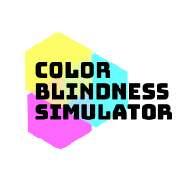
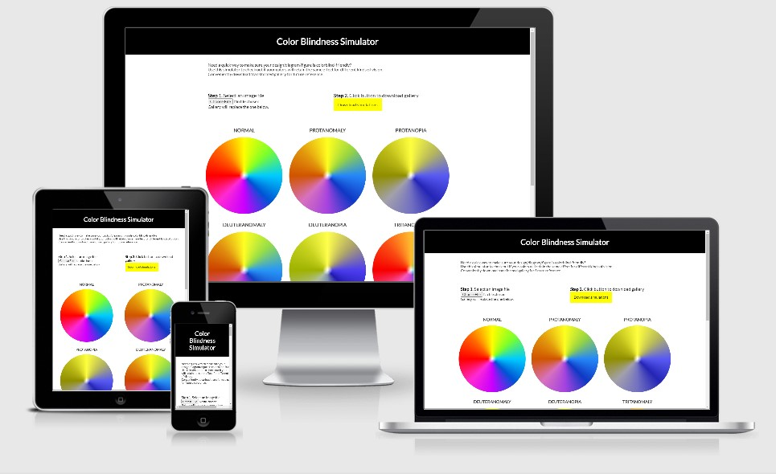
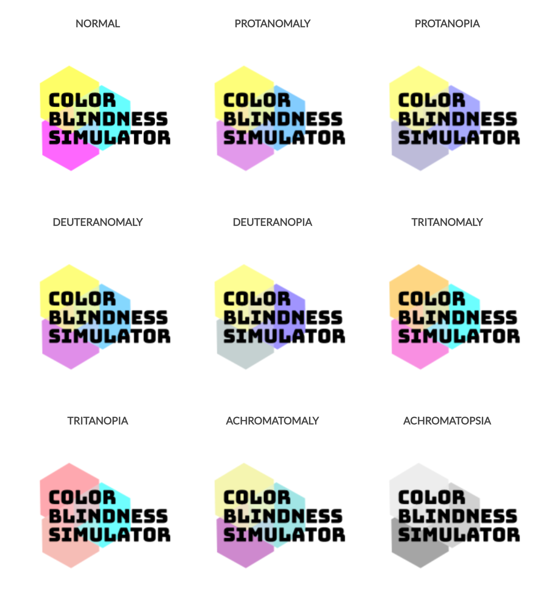
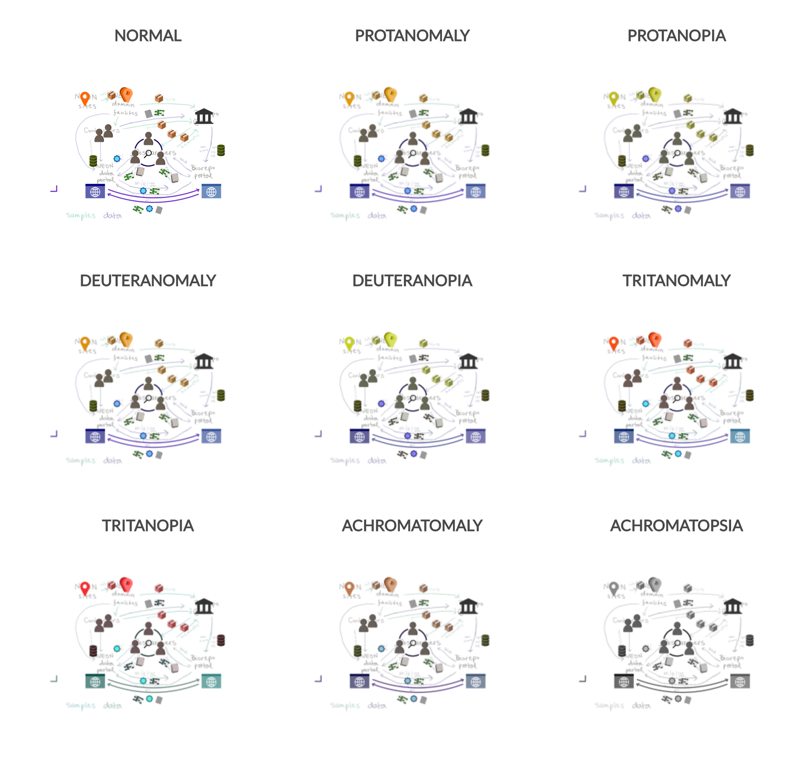

<h1 align="center">Color Blindness Simulator</h1> 

  <a href="https://laura.rochaprado.com/color-blind-simulator/">
    <!--  -->
  
  </a>

  A quick way to visualize an image using different color blindness simulation filters. Upload your file and check the updated gallery. Download the resulting gallery at once for analysis.

  

## Background

I created this app, because I was designing a complex diagram for a scientific publication that used several symbols and different colors that had meaning associated with them.

My goal was to make a diagram that would be as accessible as possible, and that included testing for different types of color blindness, so that my designs could be adjusted to enable users with color deficiency to perceive color nuance and infer their context.

However, finding an easy tool to automatically test images for different kinds of color blindness at the same time was nearly impossible. Hence the creation of this tool: the Color Blindness Simulator.

## How to use

### Web app

If you'd like to try it out, head over to the working app at https://laura.rochaprado.com/color-blind-simulator/. The app is responsive, so it works on mobile too (and you could even take a photo with it).

There are only 2-3 steps:

1. Upload the desired image for testing (accepts any file with an `image/\* MIME type`; tested with `png`, `jpg`, `gif`, `svg`, `ico`)
2. Wait shortly until main gallery is updated with resulting simulations
3. Download resulting gallery if you are so inclined

### Install to use locally

If you'd like to have the app to use it offline, head over to the releases page and download the latest bundle. Simply extract the contents of the package into a folder, and double click the `index.html` file to open it in any browser.

### Examples

  
  

## Privacy and data

All image manipulations (and upload) happen on the client-side only, meaning no data is collected at all. There is a Google Analytics snippet to track visitors and usage, so browsing isn't entirely anonymous.

## Contributing

Thanks for your interest in contributing to improve this app! For more detail, please check our [Contributing doc](CONTRIBUTING.md).

## Acknowledgements

This app modifies functions for canvas redrawing found in [cyan33's image-screenshot](https://github.com/cyan33/image-screenshot/), as well as [html2canvas 1.0.0-rc.5](https://github.com/niklasvh/html2canvas/) to facilitate image downloads.
